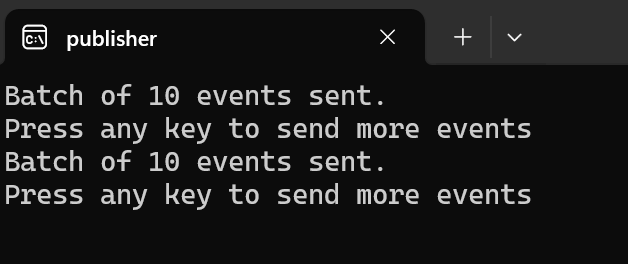
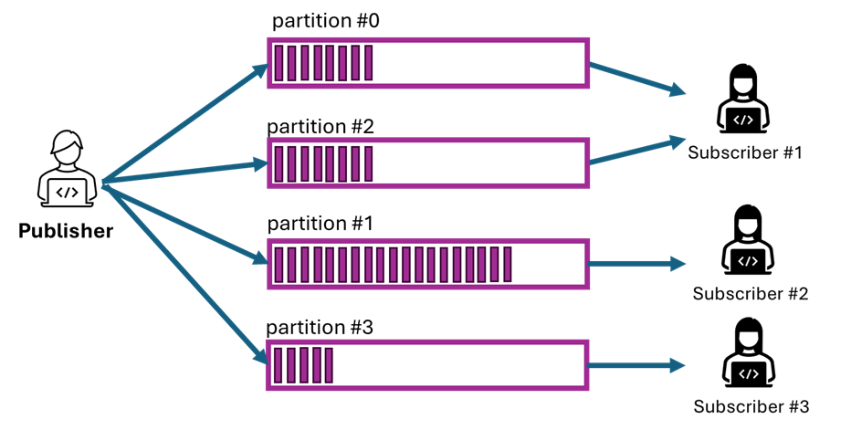

[comment]: <> (please keep all comment items at the top of the markdown file)
[comment]: <> (please do not change the ***, as well as 
 placeholders for Note and Tip layout)
[comment]: <> (please keep the ### 1. and 2. titles as is for consistency across all demoguides)
[comment]: <> (section 1 provides a bullet list of resources + clarifying screenshots of the key resources details)
[comment]: <> (section 2 provides summarized step-by-step instructions on what to demo)

[comment]: <> (this is the section for the Note: item; please do not make any changes here)
***
### Azure Event Hub publisher subscriber communication - demo scenario

**Note:** Below demo steps should be used **as a guideline** for doing your own demos. Please consider contributing to add additional demo steps.

[comment]: <> (this is the section for the Tip: item; consider adding a Tip, or remove the section between 
 and 
 if there is no tip)

**Tip:** 
1. This scenario can be used in AZ-204 Developing Azure Solutions and can demonstrate the basics of communication between apps by using a _broker_ (Event Hub) deployed in Azure.

2. The demo scenario may require the following ports for communication: 5671/5672 TCP.

3. **Subscriber** will automatically exit after 30 seconds of listening for events. PLease _do not close the console window_ before exit to let the application properly release resources when disconnected. 

4. The console application compiled with deployment will use environment variables configured with values during deployment such as Event Hub connection string and Azure Storage Account connection string.

5. Event capture functionality _starts automatically for 15 min_ only right after completion of the provisioning scenario. If you want to restart event capturing you can do that manually from the Azure portal.

***
### 1. Demo scenario

Publisher application is communicating with subscribers though Azure Event Hub. Applications can work in a different environment and need only access to Azure for communication. Protocol AMQP (Advanced Message Queuing Protocol) over TCP will be used by default for communication with Azure Event Hub. Amount of subscribers could be scaled based on partition count deployed for the Event Hub instance.

Publisher will send an event to Azure Event Hub and one of two subscribers will receive the event. All events are captured in a storage account and could be observed later. Published events will be received only once by a single subscriber. Subscribers will use a storage account for synchronization of processed events. The number of subscribers limited by partition count of Azure Event Hub.

### 2. What Resources are getting deployed

* rg-%youralias% - Azure Resource Group.
* evhns-%youralias% - Azure Event Hub
* st%youralias% - Azure Storage Account 

  

### 2. Demonstration of simple broker communication scenario.

1. After deployment you will find two shortcuts in the folder of scenario.
2. Run **Subscriber** shortcut and wait while it's loading. The console should demonstrate a subscription for four partitions.

  

3. Run **Publisher** shortcut and it automatically sends 10 events to the event hub. You can press enter to send another 10 events.

4. **Subscriber** console application should output the events received by the subscriber.

5. _Do not close the subscriber console._ It will be automatically closed in 30 seconds after start and you can close the console after it. It's important for the next step.

### 3. Demonstration of scaled communication scenario.

The scenario will mimic previous with exception of scaling subscribers. More _subscribers_ will process the events with higher speed and will not compete for events because synchronized thought storage accounts.

  

1. After deployment you will find two shortcuts in the folder of scenario.

2. Run **Subscriber** shortcut and wait while it's loading. Run two more  subscriber and observer output on their console. After 10 seconds you can see that one of the subscribers will be connected to two partitions and the other will be connected to the other single partitions. You can message '_Another processor claimed ownership_' when the partition was disconnected from one subscriber and went to another subscriber.

3. Run **Publisher** shortcut and it automatically sends 10 events to the event hub. You can press enter to send another 10 events.

4. Observe output of **subscribers**. Because publisher will send by 10 events on each partition in round-robin you can observe how the events will be received by the single subscriber

### 4. Observing event capturing.

During previous communication with Event Hub and publishing events the capturing worked under the hood. Now you can check the captured data. Be aware that capturing works only at an exact time (15min) after deployment.

To observe captured events you need to navigate to a storage account deployed in the same resource group with the scenario. Then you can find in the **capdata** appropriate folder per event hub and partition number (0-3) and current date and time.

You can observe the file content from the Azure portal or use a 3rd party tool to view the captured file. The _Apache AVRO_ format is used for capturing events.

### 5. References.

1. [Feature of Event Hub](https://learn.microsoft.com/en-us/azure/event-hubs/event-hubs-features)
2. [SDK library Azure.Messaging.EventHubs and code examples](https://www.nuget.org/packages/Azure.Messaging.EventHubs/)
3. [Event Hub code samples](https://learn.microsoft.com/en-us/azure/event-hubs/event-hubs-samples) 
4. [Event stream capturing](https://learn.microsoft.com/en-us/azure/event-hubs/explore-captured-avro-files)
2. [AVRO format documentation](https://avro.apache.org/docs/)

[comment]: <> (this is the closing section of the demo steps. Please do not change anything here to keep the layout consistent with the other demoguides.)
  
***

**Note:** This is the end of the current demo guide instructions.

